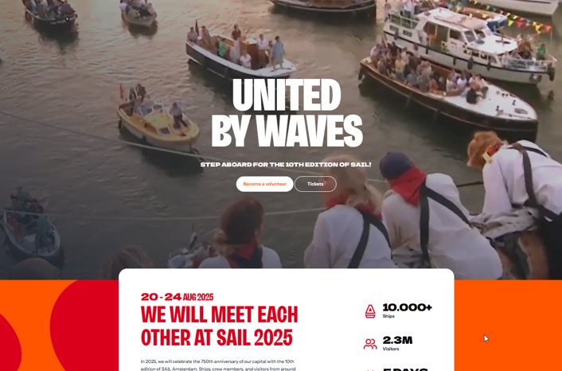

# Tips for your stay in the Netherlands

## Cash or card? Card!!!

In The Netherlands, almost everything and everywhere you can use a bank card, and in some places they even do NOT accept cash!
So, make sure you have a bank card with you for your shopping!

This is also why cash machines are a bit harder to find. We don't think you will need them, but if you do, often you find them in the supermarkets (see below).

## Supermarkets

Supermarkets you will find in Haarlem are:

- Albert Hein (a bit expensive but better quality)

- Jumbo (a bit expensive but better quality)

- Vomar (a bit cheaper)

- Dekamarkt (a bit cheaper)

- Aldi (cheaper)

## Sim cards

If you need to buy a SIM card to use extra data, check if any of these solutions suit you:

https://www.lebara.nl/en/prepaid/data-bundle-valuesim.html

## Buying Drugstore Items

Many light medicines such as paracetamol and cetirizine can just be bought at a supermarket, usually at a quite cheap price.
At the same time, you may notice that hygiene and beauty products such as cremes, deodorants etc. are quite expensive here.
For those who come with a plane and without liquids, and need for instance to buy sunscreen, but don't want to pay a 
fortune for it, we recommend going to [Normal](https://maps.app.goo.gl/KwmmrhafgM58ibPF8) in the Haarlem city center, which is considerably cheaper than the alternatives Kruidvart and Ethos. 

## Renting Bikes and public transport

See section: Moving around

## Hairdressers

If you need to visit a hairdresser while in Haarlem, we recommend Tony & Guy or CarlaH, they are good and speak English. But they are expensive, and unfortunately prices are high everywhere you go.
Check their websites to have a look and/or make an appointment:

https://www.toniandguy.nl/salon/haarlem/

https://carlah.nl/nl/

## WARNING: Sailing event this week

*GENERAL WARNING: IT MAY BE BUSY, ON THE ROADS, ON THE TRAINS AND ON THE WATER, ALLOW MORE TIME FOR EVERYTHING!* If you want to hire something (bike, car, boat, etc.) we recommend **prebooking**

https://www.sail.nl/en

    

