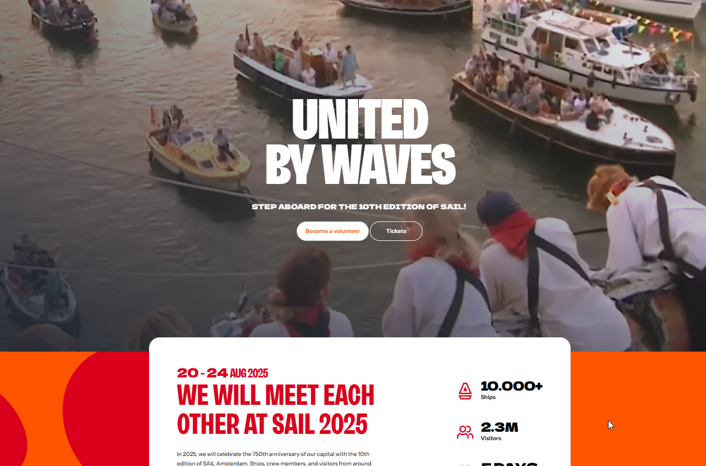

# Tipps für euren Aufenthalt in den Niederlanden

## Bargeld oder Karte? Karte!!!

In den Niederlanden könnt ihr für fast alles und überall eine Bankkarte benutzen, und an einigen Stellen akzeptieren sie sogar kein Bargeld!
Achtet also darauf, immer eure eine Bankkarte dabei zu haben!

Das ist auch der Grund, warum Geldautomaten etwas schwerer zu finden sind. Wir glauben nicht, dass ihr einen Geldautomaten brauchen werdet, aber falls doch, findet ihr diese oft in den Supermärkten (siehe unten).

## Supermärkte

Holländische Supermarktketten sind die folgenden:

- Albert Heijn (etwas teuer, aber besserer Qualität)

- Jumbo (etwas teuer, aber besserer Qualität)

- Vomar (etwas billiger)

- Dekamarkt (etwas billiger)

- Aldi (billiger)

- Dirk (der billigste, aber glaube ich nicht in Haarlem zu finden)

## Kaufen von Drogerieartikeln

Viele leichte Medikamente wie Paracetamol und Cetirizin können einfach in einem Supermarkt gekauft werden, normalerweise zu einem ziemlich günstigen Preis.
Allerdings werdet ihr bald feststellen, dass Hygiene- und Schönheitsprodukte wie Cremes, Deodorants usw. hier ziemlich teuer sind.
Für diejenigen, die mit einem Flugzeug und ohne Flüssigkeiten kommen und für den Beispiel Sonnenschutzmittel kaufen müssen, aber kein Vermögen dafür ausgeben wollen, denen empfehlen wir zu [Normal](https://maps.app.goo.gl/kwmmrhafgm58ibpf8) in der Innenstadt von Haarlem zu gehen. Normal ist deutlich billiger als die Alternativen Kruidvart und Ethos.

## Mieten von Fahrrädern und öffentlichen Verkehrsmittel

Siehe Abschnitt: Moving Around

## Friseure

Falls du in Haarlem einen Friseur besuchen musst, empfehlen wir Toni&Guy und Carlah - die sind gut und sprechen Englisch. Allerdings sind sie auch teuer -  leider sind die Preise hier leider überall hoch.
Überprüfen Sie die Websites, um einen Blick darauf zu werfen und/oder einen Termin zu vereinbaren:

[Tony&Guy](https://www.toniandguy.nl/salon/haarlem/)

[Carlah](https://carlah.nl/nl/)

## Warnung: Segelveranstaltung diese Woche

*Allgemeine Warnung: Es kann viel los sein auf den Straßen, in den Zügen!

https://www.sail.nl/en

 

