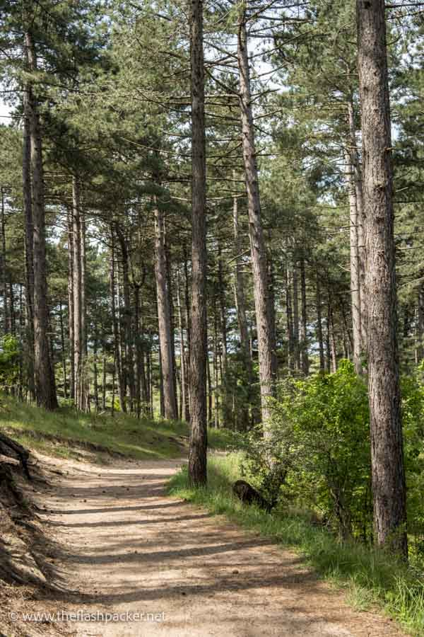

# Places to explore in and around Haarlem

## Haarlem

Many of you are directly staying in Haarlem, where we live and where also the wedding ceremonies take place.
Haarlem is a beautiful city with its own charme. Less known than Amsterdam, we hope that our wedding also gives
us the opportunity to see this town which you otherwise may never have visited.

### Haarlem itself

You arrive at the nice historical [train station](https://maps.app.goo.gl/niqLSWyTT6mtwSfT7) 
in Jugendstil, where on some platforms you can still find the original old
waiting rooms for different classes (nowadays there are only two classes on the tains, there used to be five). Some of these
waiting rooms have now been repurposed and can be entered, and for instance now take the form of a cafe.

Leave the trainstation towards the stationsplein. For those who arrive thirsty, there is a nice cafe ([Westhoff](https://maps.app.goo.gl/CqFWAS6W93KguCED9)) and a pub 
([Wachtlokal](https://maps.app.goo.gl/qQL9WdKZTRTqsHqx6)) - I recommend to try a Moersleutel beer at the bar, they make really nice IPAs. 
To see the nice bits of the city, follow the Kruisweg until you see a massive cathedral - the [St. Bavo Church](https://maps.app.goo.gl/ggBUToRJ5uZaLVcWA). 
This is not the church in which we get married, but the wedding celebrations will be very close to this church at the [Ambassador](https://maps.app.goo.gl/TBnjYfvcYx5Xpujm6). You are now in the Haarlem city center, and we invite you to explore the area around it with its many nice little streets with the 
typical old Dutch houses and flower pots on the sidewalks. 

Some highlights: 

1. Every Saturday, there is a **market** in the square near the Bavo church
2. Walk along the [Sparne](https://maps.app.goo.gl/YfBFSUWRF66X1zjm9) river, East of the cathedral, relax in one of the many cafes and watch the boats drive by. 
    You can also find a wind a Dutch **windmill** here, the [Molen de Adriaan](https://maps.app.goo.gl/hHkuw4V4h4Zpxk5EA). 
3. The [Teylers musuem](https://maps.app.goo.gl/dRj6CbWi6DdeHgoaA) is the **oldest museum** in the Netherlands (we still have to visit it).
4. Art can be found in the [Frans Hals museum](https://maps.app.goo.gl/TwBUxcAqBWxwSPXRA)
5. **Fancy coffee** is sold at the [Coffee Habits](https://maps.app.goo.gl/3LtBQaQy2cu1T49C8), which has several branches in Haarlem (also [here](https://maps.app.goo.gl/F7Ytz9Tagw73V2oNA) and very small [here](https://maps.app.goo.gl/2Eof98RQerUdzmuV6)). Patrick's favourite, but the espressi are not really in the typical Italian style)
6. [Romeo'] gives very nice **Italian style sandwiches** - the Italians might know this, but we recommend everyone else to try it if you have never eaten it.
   Try to Mortadella Special - there are some waiting times but the experience is worth the wait!
7. If you are looking for other **snacks**: in my (Patrick's) opinion, the best falafels are sold at [Syriously](https://maps.app.goo.gl/irca1mmoGXqSmY9R9), and the best burgers at [Buns of Glory](https://maps.app.goo.gl/FjTber4eA5EgY9Wk6), which also gives you a nice view on the Spaarne. 
8. The [Jopenkerk](https://maps.app.goo.gl/MEnFSkn7kYCN31R17) is a church that has been transformed into a **Brewery** - you can try many variants of the Jopen beer here and also eat some food.
9. If you are into **beers**, not far from the Jopenkerk is also the [Uiltje bar](https://maps.app.goo.gl/y6YsvX32xccgYgTy5) which has a large selection of beers on tap. More in the city center is the Bierlokaal [de Uiver](https://maps.app.goo.gl/nYr5HVxmiPDb7Sox8) which also has many different beers to try on tap.
10. For the **metalheads**: near the Bavo church, there is the [Wolfhound](https://maps.app.goo.gl/7Xy21hDTd14RQXdy7), an Irish pub that usually plays good music and has nice beers. According to a friend, they also do good burgers, but I haven't tried them yet. The alternative bar of the city is the [Anti-Bar](https://maps.app.goo.gl/BQ9gWDbL8gjQwRx99), which is near the Uiltje bar mentioned above.
11. A bit further away from the center, there is also another cathedral which is still used as a Catholic church, confusingly named very similar to the other one: the [St. Bavo cathedral](https://maps.app.goo.gl/jPU82bMiAyPYGvxc6).  
12. The best pizza (Patrick: "indeed the best I have ever eaten outside of Italy, besides the one my future wife makes") is served at the [Piccolo Forno](https://maps.app.goo.gl/ExB1ieoMEymuZNwo7). You need to reserve here (the waiting list happens by default, but it doesn't mean you won't get a seat). Italians be warned: most pizzerie won't offer you the same quality that you are used to. However, Piccolo Forno is the exception.
13. But hey, you are in The Netherlands. Perhaps you want to try also something typical Dutch. Then try their "borrel" food (borrel means "aperitivo" in practice): bitterballen, frikandellen, kaastengels and kaas souffle!
14. Don't forget to try the Dutch fries!

     

### Hiking and Cycling around Haarlem

The Netherlands may not have the mountains you are used to from Campania or Saxony, but there is still nice nature to explore for those who like to walk or hike.
If you have a few hours, we really recommend to visit **National Park Zuid-Kennermerland**, either by bike or by food. If you take a walk through this park, you will encounter the whole variety of Dutch landscape: starting with a more forestly landscape with lakes, going over the open dunes and ending on the large wide beaches at the open sea. 

To reach it, you may need a bike or car, or a bus: best is to get to the [Bezoekerzentrum](https://maps.app.goo.gl/BwBTRFJGDDh7Lf9L9) of Zuid-Kennemerland. From here you can either continue by bike or by food (most of the time, they have separated paths). The Bezoekerzenturm itself offers surprsingly good food - if you arrive for breakfast, you can have Eggs Benedict here, just to give you an example. There is also a playground for the kids. A few meters away there is a nice lake with a beach, which is a nice alternative to the sea beaches mentioned below. I recommend to follow the signs to **Vogelmeer** (Germans, don't get confused, Dutch switch the words for "See" and "Meer" - "zee" is the sea, a "meer" is a lake). From Vogelmeer, you can then walk over the open dunes towards the sea, for instance getting out at **Parnassia beach**, which has a beach club, or at other less populated entrances to the beaches. 

    

## Beaches in the Area

Beaches in the Netherlands are usually free, so you can just rest wherever you feel like it. The more populated beaches have bars directly on the beach where you
can go to eat a snack or drink something. You will also find tractors driving through the sand selling either ice cream or mostly fish-based snacks. Must-tries:
the Haaring, which is a refreshing Dutch delicacy (cold fish), and Kibbeling (deep-fried pieces of fish with sauce).

The most popular and easily reachable beach both from Haarlem and Amsterdam is in [Zandvoort](https://maps.app.goo.gl/QxgLGpEqsXeQNeCa9), which you can reach by train. This is a very large and touristy beach, that is also mostly supervised by seaguards - so you don't have to worry about taking a swim. Zandfort itself is not very beautiful, and caters mainly
towards beach tourism. 

From Haarlem, a straight 20 minute bicyle ride towards the East brings you to [Bloemendaal an Zee](https://maps.app.goo.gl/YAW29yiZmEDZzmE6A), which is a bit quiter, but still offers bars. This is the easiest beach reachable by bike - you just cycle straight the whole time on a separated bicycle road next to the highway.

Then there is the [Parnassia-Strand](https://maps.app.goo.gl/GuHeLPAyP9PJDtpNA), which can be reached by either hiking or cycling through the national park **Zuid-Kennermerland** - while usualy also a bit busy on sunny days, you don't have to walk far if you want a silent spot for yourself.

If you don't need the open sea and prefer some trees around you, there is also a beach at the lake [Het Wed](https://maps.app.goo.gl/ud8m5oCB1MNbgJNU9).

   

## Amsterdam

COMING SOON
