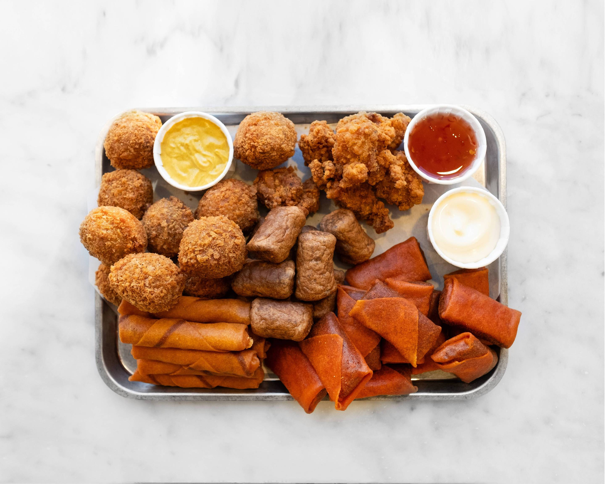
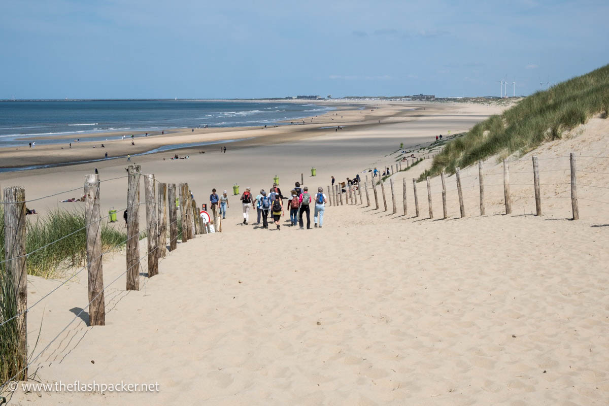
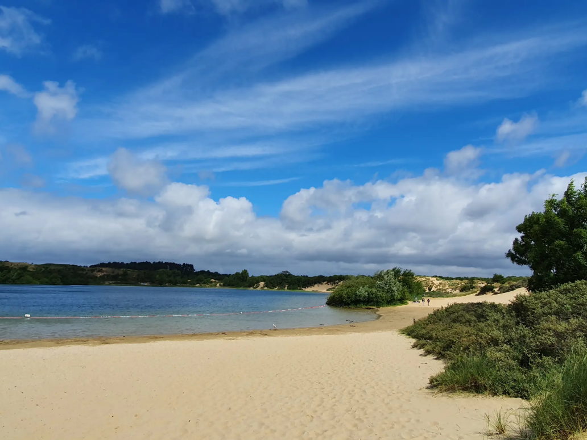

Haarlem è una città bellissima con un fascino tutto suo. Meno conosciuta di Amsterdam, speriamo che il nostro matrimonio sia anche l’occasione per scoprire questa città che altrimenti forse non avreste mai visitato.

### Haarlem in sé

Arrivate alla graziosa storica [stazione](https://maps.app.goo.gl/niqLSWyTT6mtwSfT7) in stile Jugendstil, dove su alcune banchine si trovano ancora le vecchie sale d’attesa originali per le diverse classi (oggigiorno ci sono solo 2 classi sui treni, prima ce n'erano cinque). Alcune di queste sale d’attesa sono state riconvertite e sono accessibili, ad esempio sotto forma di caffè.

Uscite dalla stazione in direzione dello stationsplein (piazzale della stazione). Per chi arriva assetato, c’è un bel caffè ([Westhoff](https://maps.app.goo.gl/CqFWAS6W93KguCED9)) e un pub ([Wachtlokal](https://maps.app.goo.gl/qQL9WdKZTRTqsHqx6)) – consiglio di provare una birra Moersleutel al bar, fanno delle ottime IPA.  
Per vedere le parti più belle della città, seguite il Kruisweg finché non vedete una grande cattedrale – la [St. Bavo Church](https://maps.app.goo.gl/ggBUToRJ5uZaLVcWA).  
Non è la chiesa dove ci sposiamo, ma i festeggiamenti si terranno molto vicino, presso l’[Ambassador](https://maps.app.goo.gl/TBnjYfvcYx5Xpujm6). Siete ora nel centro di Haarlem, e vi invitiamo a esplorare la zona circostante con le sue tante stradine caratteristiche, le tipiche case olandesi antiche e i vasi di fiori sui marciapiedi.

Alcuni punti salienti:

1. Ogni sabato c’è un **mercato** nella piazza vicino alla chiesa di Bavo.  
2. Passeggiate lungo il fiume [Sparne](https://maps.app.goo.gl/YfBFSUWRF66X1zjm9), a est della cattedrale, rilassatevi in uno dei tanti caffè e guardate passare le barche.  
   Qui si trova anche un **mulino a vento** olandese, il [Molen de Adriaan](https://maps.app.goo.gl/hHkuw4V4h4Zpxk5EA).  
3. Il [Teylers musuem](https://maps.app.goo.gl/dRj6CbWi6DdeHgoaA) è il **museo più antico** dei Paesi Bassi (dobbiamo ancora visitarlo).  
4. L’arte si trova al [Frans Hals museum](https://maps.app.goo.gl/TwBUxcAqBWxwSPXRA).  
5. Il **caffè gourmet** si trova al [Coffee Habits](https://maps.app.goo.gl/3LtBQaQy2cu1T49C8), che ha diverse sedi a Haarlem (anche [qui](https://maps.app.goo.gl/F7Ytz9Tagw73V2oNA) e molto piccola [qui](https://maps.app.goo.gl/2Eof98RQerUdzmuV6)). I preferiti di Patrick, ma l'espresso non e' nello stile italiano.  
6. [Romeo](https://maps.app.goo.gl/1w3HV9e3k8wfVhTg6) offre ottimi **panini in stile italiano** – gli italiani forse già lo conoscono, ma lo consigliamo a tutti gli altri se non li avete mai provati.  
   Prova il Mortadella Special – bisogna aspettare un po' ma ne vale la pena!  
7. Se cercate altri **snack**: secondo me (Patrick), i migliori falafel si trovano da [Syriously](https://maps.app.goo.gl/irca1mmoGXqSmY9R9), e i migliori hamburger da [Buns of Glory](https://maps.app.goo.gl/FjTber4eA5EgY9Wk6), che offre anche una bella vista sullo Spaarne.  
8. La [Jopenkerk](https://maps.app.goo.gl/MEnFSkn7kYCN31R17) è una chiesa trasformata in **birrificio** – qui potete provare molte varianti della birra Jopen e anche mangiare qualcosa.  
9. Se vi piacciono le **birre**, non lontano dalla Jopenkerk c’è anche l'[Uiltje bar](https://maps.app.goo.gl/y6YsvX32xccgYgTy5) con un’ampia selezione di birre alla spina. Più in centro c’è il Bierlokaal [de Uiver](https://maps.app.goo.gl/nYr5HVxmiPDb7Sox8), anch’esso con molte birre diverse alla spina.  
10. Per gli **amanti del metal**: vicino alla chiesa di Bavo c’è il [Wolfhound](https://maps.app.goo.gl/7Xy21hDTd14RQXdy7), un pub irlandese che di solito mette buona musica e ha ottime birre. Secondo un amico, fa anche dei buoni burger, ma non abbiamo ancora provato. Il bar alternativo della città è l’[Anti-Bar](https://maps.app.goo.gl/BQ9gWDbL8gjQwRx99), vicino al bar Uiltje menzionato sopra.  
11. Un po’ più lontano dal centro, c’è un’altra cattedrale ancora in uso come chiesa cattolica, con un nome molto simile all’altra: la St. Bavo cathedral.  
12. La miglior pizza (Patrick: "di fatto la miglior pizza che abbia mai mangiato fuori dall'Italia, eccetto quella che fa la mia futura moglie") si trova al [Piccolo Forno](https://maps.app.goo.gl/ExB1ieoMEymuZNwo7). È necessario prenotare (la lista d'attesa appare di default, ma non significa che e' sempre pieno e non riuscirai ad andarci). Attenti, italiani: la gran parte delle pizzerie non offre la qualita' a cui siete abituati, ma Piccolo Forno e' l'eccezione.
13. Ma ehi, siete nei Paesi Bassi. Forse volete provare anche qualcosa di tipico olandese. Allora provate il cibo da "borrel" (borrel significa "aperitivo" in pratica): bitterballen, frikandellen, kaastengels e kaas soufflé!  
14. Non dimenticate di provare le patatine fritte olandesi!

       

---

### Escursioni e giri in bici nei dintorni di Haarlem

I Paesi Bassi forse non hanno le montagne a cui siete abituati in Campania o Sassonia, ma ci sono comunque bei paesaggi da esplorare per chi ama camminare o fare escursioni.  
Se avete qualche ora, vi consigliamo vivamente di visitare il **Parco Nazionale Zuid-Kennemerland**, sia in bici che a piedi. Camminando in questo parco, incontrerete tutta la varietà del paesaggio olandese: si parte da una zona più boschiva con laghi, si attraversano le dune aperte e si arriva alle ampie spiagge sul mare aperto.

Per raggiungerlo, potreste aver bisogno di una bici, un’auto o un autobus: l’ideale è arrivare al [Bezoekerzentrum](https://maps.app.goo.gl/BwBTRFJGDDh7Lf9L9) di Zuid-Kennemerland. Da qui potete proseguire in bici o a piedi (il piu' delle volte, la ciclabile e i percorsi a piedi sono separati). Il Bezoekerzentrum offre sorprendentemente buon cibo – se arrivate per colazione, potete ordinare le uova alla Benedict, per esempio. C’è anche un parco giochi per bambini. A pochi metri c’è un bel lago con una spiaggia, una buona alternativa alle spiagge marine menzionate sotto. Consiglio di seguire i cartelli per il **Vogelmeer** (da non confondersi – "zee" e' il mare, a "meer" e' il lago). Dal Vogelmeer potete poi camminare sulle dune aperte verso il mare, ad esempio uscendo alla Parnassia beach, dove c’è uno stabilimento balneare, oppure in altri accessi meno affollati alle spiagge.

    

## Spiagge nei dintorni

Le spiagge nei Paesi Bassi sono solitamente gratuite, quindi potete semplicemente fermarvi dove preferite. Le spiagge più frequentate hanno bar direttamente sulla sabbia dove potete mangiare uno snack o bere qualcosa. Troverete anche trattori che passano sulla sabbia vendendo gelati o, più spesso, snack a base di pesce. Da provare assolutamente: le aringhe, una fresca specialità olandese (pesce freddo), e il Kibbeling (bocconcini di pesce fritti con salsa opzionale).

La spiaggia più popolare e facilmente raggiungibile sia da Haarlem che da Amsterdam è quella di [Zandvoort](https://maps.app.goo.gl/QxgLGpEqsXeQNeCa9), raggiungibile in treno. È una spiaggia molto grande e turistica, per lo più sorvegliata da bagnini – quindi potete fare il bagno in tranquillità. Zandvoort in sé non è molto bella e si rivolge principalmente al turismo balneare.

Da Haarlem, una pedalata diretta di 20 minuti verso est vi porta a [Bloemendaal an Zee](https://maps.app.goo.gl/YAW29yiZmEDZzmE6A), che è un po’ più tranquilla, ma offre comunque bar. È la spiaggia più facile da raggiungere in bici – basta pedalare sempre dritto su una pista ciclabile separata accanto alla strada principale.

Poi c’è la [Parnassia-Strand](https://maps.app.goo.gl/GuHeLPAyP9PJDtpNA), raggiungibile a piedi o in bici attraverso il parco nazionale Zuid-Kennermerland – anche se di solito è un po’ affollata nelle giornate di sole, non dovrete camminare molto per trovare un angolo tranquillo tutto per voi.

Se non avete bisogno del mare aperto e preferite un po’ di alberi intorno, c’è anche una spiaggia sul lago [Het Wed](https://maps.app.goo.gl/ud8m5oCB1MNbgJNU9).

   

## Amsterdam

PROSSIMAMENTE
