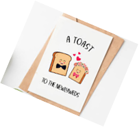
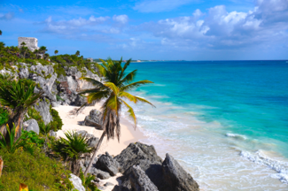

# Gifts

**We are not expecting any gift!**

We know how expensive it is for all of you to join us for this
special moment, and we are extremely thankful for that!
Perhaps a nice card with a personal message would be a
very nice memory of you being there!

For those who say “Hey, we anyway want to give you
something” and they wonder if we created a wedding registry with things we need for our home, we would like to say: we already live together,
have a fully furnished apartment, and very little space left
for objects, which is why we did not create a wish list.

Still not happy and you still insist on giving us
something more than your presence or your card?
Then, if you want to, you could give a small contribution to our
honeymoon in Mexico, on Riviera Maya,
happening on October: we use Paypal, see below our email addresses.

or

(please add a note so we know who you are :))

In case you don't use PayPal: let us know via the email addresses above to discuss alternative ways. (We didn't want to publish our bank details on the open web.)

**IMPORTANT: please no cash on
the wedding day!**
