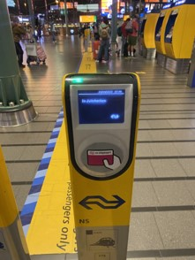
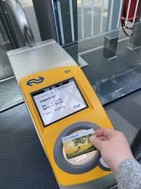
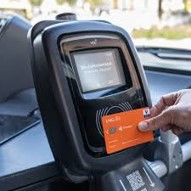
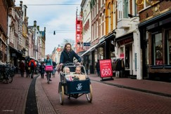
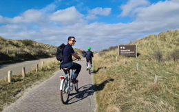
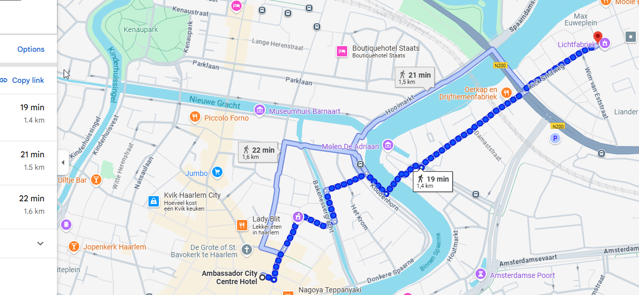
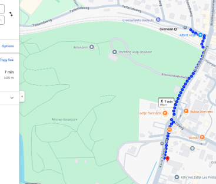
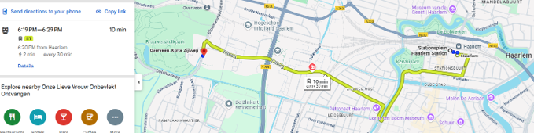
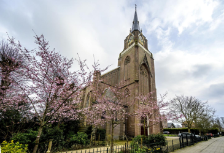

# Moving around

## Public transport

*App*: **9292** (it works for any type of transport, more reliable of Google Maps)

*Tickets*: use your bank card (one per person, also the kids, if they are too old for discounts). You need to check in and check out on machines at the entrance and exit of stations, buses and trams. Don’t forget **checking out** otherwise they charge you more money!

*Transport companies*: NS (Trains), Connexxion (buses, in and out of cities), GVB (Amsterdam only)

*Kids*: kids pay a reduced ticket on the trains and for free on Connexxion buses (if younger than 11): [kids on the train](https://www.ns.nl/en/tickets/railrunner) and [kids on the bus](https://www.connexxion.nl/en/shop/tickets/free-kids-day-ticket)

    

## Bycicle

The bicycle is definitely the best way to enjoy your time in the Netherlands!
You can rent a bike in advance (recommended if you are sure you want to rent it anyway!), here is two convenient places in Haarlem, but there are more: [rent-a-bike-haarlem](https://www.rentabikehaarlem.nl) or [black-bikes](https://black-bikes.com/bike-rental-locations/haarlem/)

Haarlem is a beautiful city to cycle around. Moreover, in 20 minutes cycling you are on the dunes, and in 30 minutes on the nice Bloemendal beaches!

  

Be aware: if you want to move from a city to another, and it’s too far to cycle, you can take your bike on the train only in the off-peaks times and for a fee. Info here: [bikes-on-the-train](https://www.ns.nl/en/travel-information/bikes-on-the-train.html)

## For those who are staying at Camping De Liede

The itinerary suggested by Google Maps to cycle to our place* is a bit ugly, this one looks nicer: https://maps.app.goo.gl/gWdruLYju6bk3fDWA

 

The closest station is Haarlem Sparnwoude station. Not supernice walking to there, but you can do it (it takes about 20 mins), if you have a bike it would be nicer and faster.

## For those who are staying at the Ambassador Hotel

You are right in the middle of the city centre!

To come to our place, you walk around 15-20 minutes, or you cycle in 5 minutes, or you take a taxi.

 

## To the church
The Church where we get married is at Korte Zijlweg 5, 2051 BD Overveen.
You can get there:
By bike (15 minutes from our home, for reference)
By train, getting out at Overveen station (one stop after Haarlem) and walking 7 minutes

 

By bus: Connexxion bus (line 81) connects Haarlem city centre with the church and the stop is right in front of the church (10 minutes from Haarlem station, for reference)

 

 

