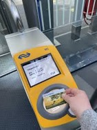
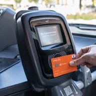
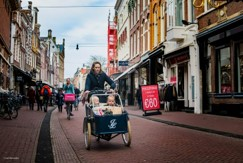
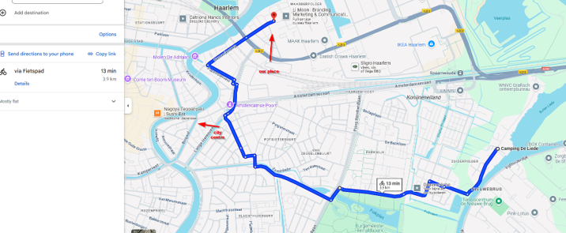

# Wie man von A nach B kommt

## Öffentliche Verkehrsmittel

*App*: **9292** (funktioniert für jede Art von Verkehrsmittel, und meistens besser als Google Maps)

*Tickets*: Ihr könnt einfach eure Bankkarte (Kredit oder Debit) als Ticket benutzen (eine pro Person, auch für Kinder die zu alt für den Discount sind). 
Über die Maschinen am Eingang und Ausgang von Bahnhofen, Bussen und Straßenbahnen checkt ihr ein und aus - beim Auschecken wird dann automatisch
der beste Preis für die Reise berechnet. Vergesst nicht, **auszuchecken** --- ansonsten kostet es mehr Geld! Wenn ihr keine Bankkarte verwenden möchtet oder eure Karte nicht funktioniert, kauf am besten die Tickets über die App des jeweiligen Verkehrsunternehmens (siehe unten). Manchmal kann man durch den Kauf über die App Geld sparen, besonders wenn man im Voraus bucht. Ticket-Automaten gibt es schon auch, sind aber nicht mehr so verbreitet hier. Erwartet keine Ticketautomaten
in der Strassenbahn wie in Dresden.

*Transportunternehmen*: NS (Züge), Connexxion (Busse, in und außerhalb von Städten), GVB (nur Amsterdam)

*Kinder*: Kinder zahlen ein reduziertes Ticket in den Zügen und fahren kostenlos in Connexxion-Bussen (falls sie jünger als 11 sind): [Kinder im Zug](https://www.ns.nl/en/tickets/railrunner) und [Kinder im Bus](https://www.connexxion.nl/en/shop/tickets/free-kids-day-ticket)

  

## Fahrrad

Das Fahrrad ist definitiv das beste Transportmittel in den Niederlanden.
Ihr könnt Fahrräder im Voraus mieten (empfohlen, wenn ihr sicher seid, dass ihr es sowieso mieten möchtet!).

Haarlem ist eine wunderschöne Stadt, um mit dem Fahrrad zu fahren. Darüber hinaus seid ihr von Haarlem in 20 Minuten auf den Dünen und in 30 Minuten an den schönen Stränden von Bloemendal!

 

*Achtung:* Wenn ihr mit dem Fahrrad in die nächste Stadt wollt und es zu weit zum Radeln ist, achtet darauf dass ihr ihr euer Fahrrad nur außerhalb der Stoßzeiten und gegen eine Gebühr in den Zug nehmen könnt. Weitere Infos hier: [Fahrräder im Zug](https://www.ns.nl/en/travel-information/bikes-on-the-train.html)

## Taxi

Taxi's kosten hier ähnlich viel wie in Deutschland – aber wenn ihr es mit ein paar Personen teilt, kann das eine gute Option sein.

Hier sind einige Möglichkeiten (alle haben eine App):

Staxi: feste Preise nach der Buchung, ähnlich wie Uber, aber günstiger – https://www.staxi.nl/en/

Taxi Haarlem: Rabatte bei Vorausbuchung – https://sneleentaxi.nl/

Uber: ja, Uber gibt es hier, ist aber absolut NICHT die günstigste Option! – https://www.uber.com/nl/en/

## Für diejenigen, die in Camping de Liede übernachten

Die von Google Maps vorgeschlagene Reiseroute, um uns zu besuchen, ist diese:

Der nächste Bahnhof von euch ist der Bahnhof Haarlem Spaarnwoude. 
Allerdings sind es zu diesem Bahnhof etwa 20 Minuten Fußweg. Mit Fahrrad ist es schöner und schneller.

## Für diejenigen, die im Ambassador Hotel übernachten

Ihr seid mitten im Stadtzentrum!

Um uns zu besuchen, lauft ihr etwa 15 bis 20 Minuten, mit Fahrrad sind es 5, oder ihr nehmt einfach ein Taxi.

## Zur Kirche
Die Kirche, in der wir heiraten, befindet sich in Korte Zijlweg 5, 2051 BD Overveen.
So kommt ihr dort hin:

- mit dem Fahrrad (15 Minuten von uns entfernt, als Referenz);

- mit dem Zug zum Bahnhof Overveen (eine Station nach Haarlem) und dann 7 Minuten laufen;

Mit dem Bus: mit dem Connexxion Bus (Linie 81) kommt ihr vom Haarlemer Stadtzentrum zur Kirche und die Haltestelle befindet sich direkt vor der Kirche (10 Minuten vom Haarlemer Bahnhof entfernt, als Referenz)

## Zum Restaurant
Das Restaurant (Ambassador Hotel, Erdgeschoss) kann in etwa 30 Minuten von der Kirche aus erreicht werden:

- mit dem Fahrrad (10-15 Minuten)

- mit dem Zug: Zum Bahnhof Overveen laufen, Zug nach Haarlem nehmen (eine Station), von dort zum Restaurant laufen (insgesamt etwa 30 Minuten, aber eine schöne Route) 

- mit dem Bus: die Linie 81 des Connexxion Bus (hält nahe der Kirche), bis nach Ruychaverstraat, dann 11 Minuten laufen

Zu Fuß, wenn es euch nichts ausmacht, zu laufen: ungefähr eine halbe Stunde

**WICHTIG**:
Klingen diese Optionen für euch unzumutbar oder problematisch, und ihr möchtet, dass wir eine Taxifahrt organisieren?

Dann nehmt gern Kontakt mit uns auf – wir schauen, was wir für euch tun können!

