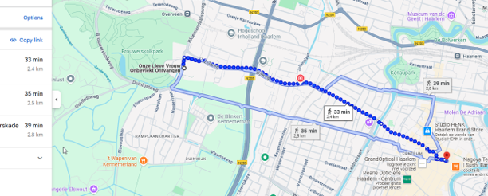
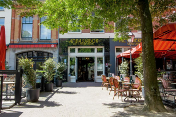

# Muoversi

## Trasporto pubblico

*App*: **9292** (Funziona per qualsiasi tipo di trasporto, più affidabile di Google Maps)

*Biglietti*: usa la tua carta bancaria (una per persona, anche per i bambini, se sono troppo grandi per gli sconti). Devi fare check-in e check-out sulle macchinette all’ingresso e all’uscita di stazioni, autobus e tram. Non dimenticare di fare il check-out, altrimenti ti addebitano di più!

*Compagnie di trasporto*: NS (treni), Connexxion (autobus, dentro e fuori le città), GVB (solo Amsterdam)

*Bambini*: i bambini pagano un biglietto ridotto sui treni e viaggiano gratis sugli autobus Connexxion (se più giovani di 11): [bambini in treno](https://www.ns.nl/en/tickets/railrunner) e [bambini in autobus](https://www.connexxion.nl/shop/tickets/free-day)

  

## Bicicletta

La bicicletta è sicuramente il modo migliore per godersi il tempo nei Paesi Bassi! Puoi noleggiarne una in anticipo (consigliato se sei sicuro di volerla noleggiare comunque!), ecco due posti comodi a Haarlem, ma ce ne sono altri: [rent-a-bike-haarlem](https://www.rentabikehaarlem.nl) o [black-bikes](https://black-bikes.com/bike-rental-locations/haarlem/).

Haarlem è una città bellissima da girare in bici. Inoltre, in 20 minuti di pedalata sei tra le dune, e in 30 minuti sulle belle spiagge di Bloemendaal!

  

Attenzione: se vuoi spostarti da una città all’altra e la distanza è troppa per pedalare, puoi portare la bici sul treno solo negli orari non di punta e pagando un supplemento. Info qui: [Bike-on-the-train](https://www.ns.nl/en/travel-information/bikes-on-the-train.html)

## Per coloro che soggiornano al Camping de Liede

L’itinerario suggerito da Google Maps per arrivare in bici da noi è un po’ brutto, questo sembra più carino:
https://maps.app.goo.gl/gWdruLYju6bk3fDWA

 

La stazione più vicina è Haarlem Sparnwoude. Non è una passeggiata bellissima, ma si può fare (ci vogliono circa 20 minuti); se hai una bici è più piacevole e veloce.

## Per coloro che soggiornano all'Ambassador Hotel

Sei proprio nel centro della città!

Per arrivare da noi, puoi camminare circa 15-20 minuti, oppure pedalare in 5 minuti, oppure prendere un taxi.

 

## Per coloro che soggiornano da altre parti

Il tuo punto di riferimento è la stazione di Haarlem station. È nel centro della città, a 15 minuti a piedi da casa nostra, e anche a 15 minuti a piedi dall’Ambassador hotel. Quindi, alla fine dei festeggiamenti, ti basterà una breve passeggiata per tornare in stazione.

## In chiesa
La chiesa dove ci sposiamo si trova in Korte Zijlweg 5, 2051 BD Overveen. Puoi arrivarci:

- In bici (15 minuti da casa nostra, come riferimento)

- In treno, scendendo alla stazione Overveen (una fermata dopo Haarlem) e camminando 7 minuti

 

- In autobus: l’autobus [Connexxion] (linea 81) collega il centro di Haarlem con la chiesa e la fermata è proprio davanti alla chiesa (10 minuti dalla stazione di Haarlem, come riferimento)

 

 

## Al ristorante
Il ristorante (Ambassador Hotel, piano terra) si raggiunge in circa 30 minuti dalla chiesa:

- In bici (10-15 minuti)

- In treno: cammina fino alla stazione di Overveen station, prendi il treno per Haarlem, cammina fino al ristorante – tempo totale circa 30 minuti

- In autobus: linea 81 [Connexxion Bus] dalla chiesa, scendi a Ruychaverstraat cammina 11 minuti

 

- A piedi, se non ti dispiace camminare! Circa mezz’ora

 

 

**IMPORTANTE**:
Queste opzioni ti sembrano scomode o problematiche e vorresti che ti organizzassimo un passaggio, ad esempio in taxi? Contattaci e vedremo cosa possiamo fare!

