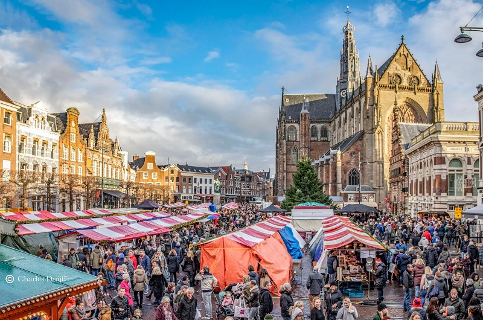
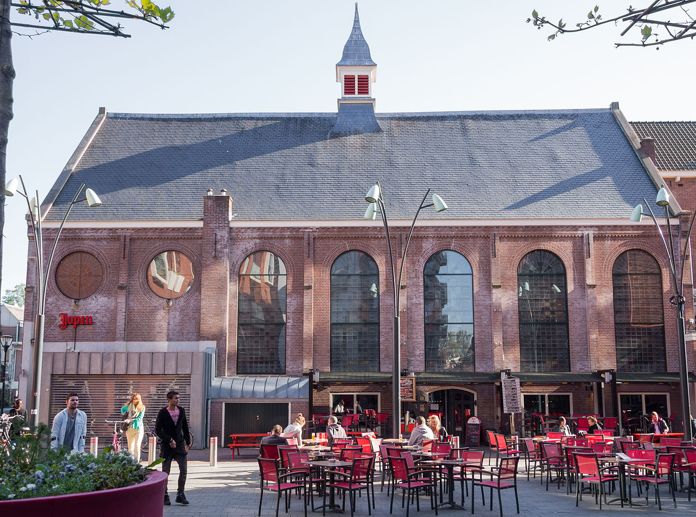
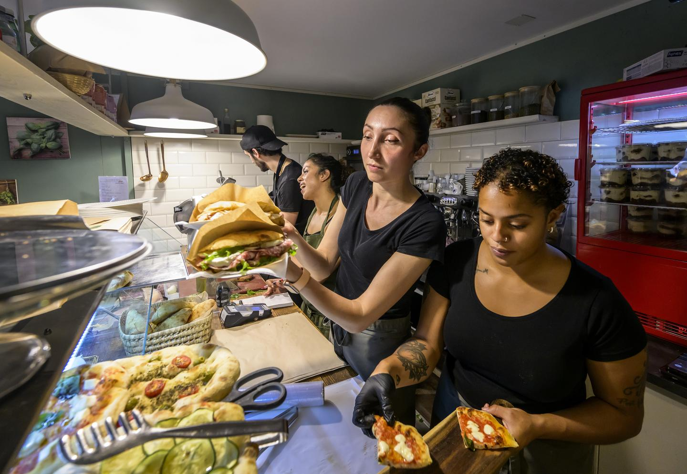
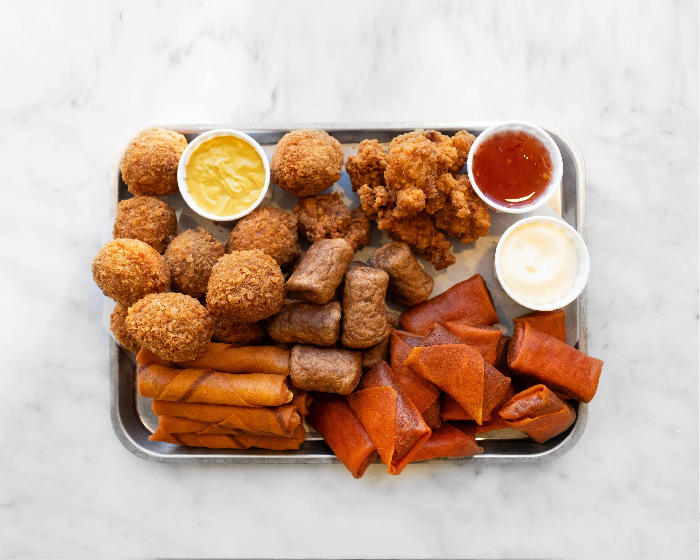
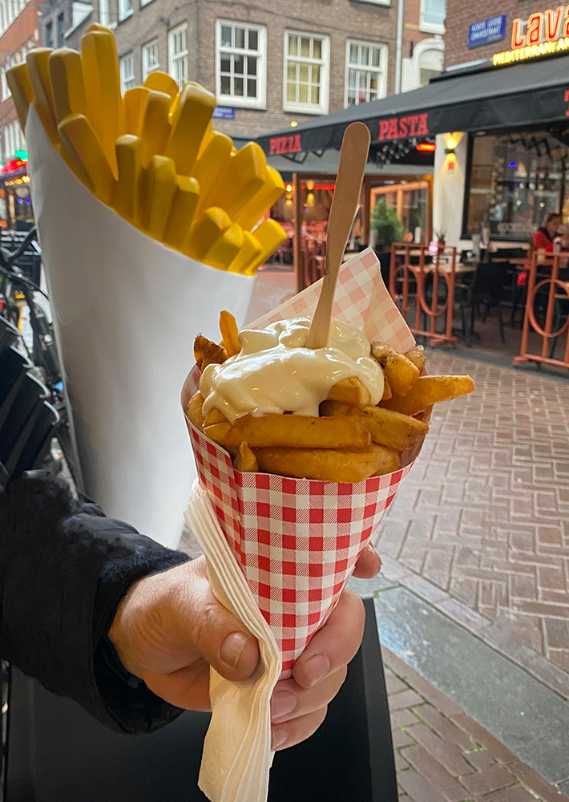
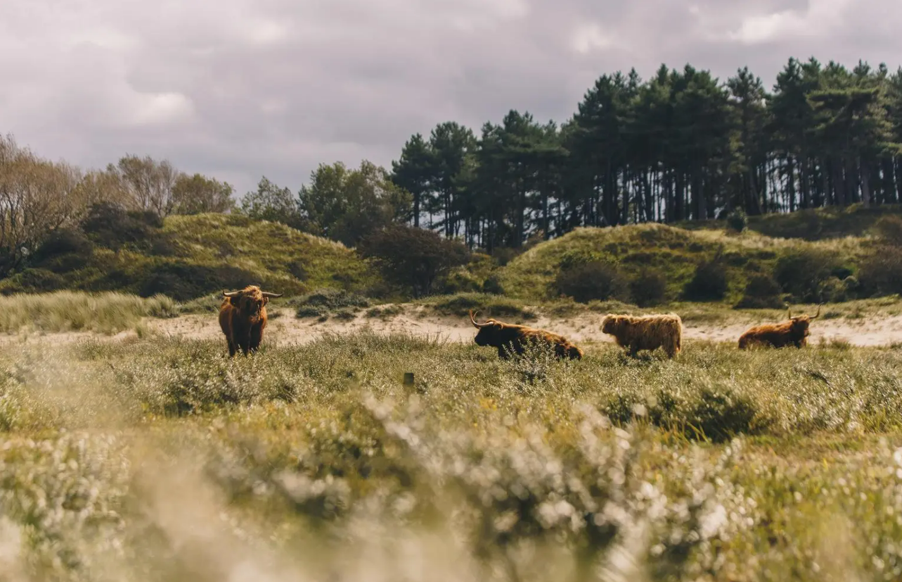
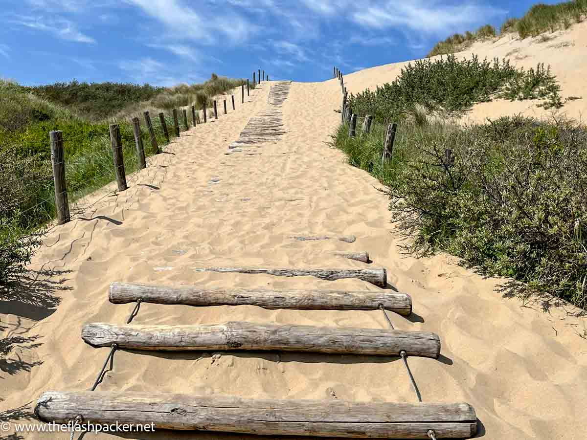
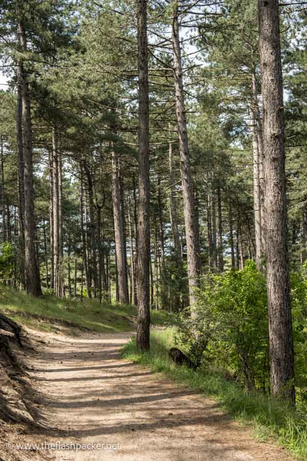
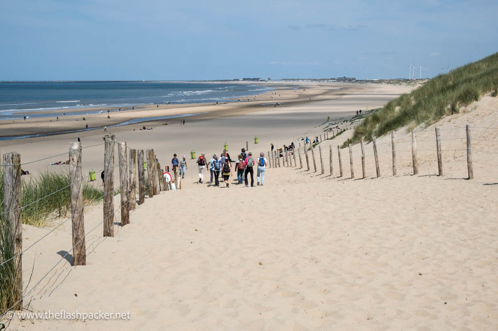
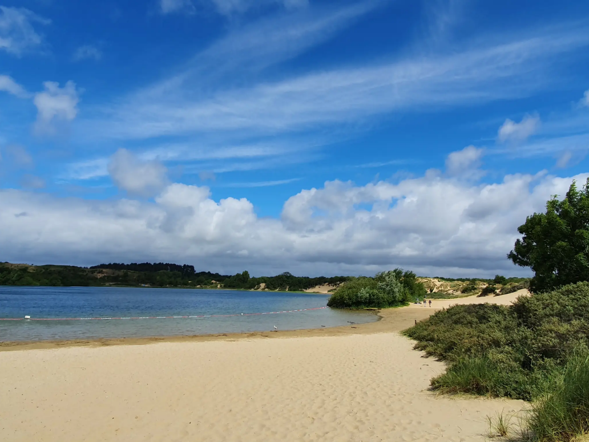

*Warnung --- KI-generiert und noch nicht ueberprueft*

# Places to explore in and around Haarlem

## Haarlem

Viele von euch übernachten direkt in Haarlem, wo wir wohnen und wo auch die Hochzeitsfeierlichkeiten stattfinden.
Haarlem ist eine wunderschöne Stadt mit ganz eigenem Charme. Weniger bekannt als Amsterdam, hoffen wir, dass unsere Hochzeit euch auch die Gelegenheit gibt, diese Stadt zu entdecken, die ihr sonst vielleicht nie besucht hättet.

### Haarlem selbst

Ihr kommt an am schönen historischen  [train station](https://maps.app.goo.gl/niqLSWyTT6mtwSfT7) im Jugendstil, wo man auf einigen Bahnsteigen noch die originalen alten Wartesäle für verschiedene Klassen findet (nowadays there are only two classes on the tains, there used to be five). Einige dieser Wartesäle wurden inzwischen umfunktioniert und sind zugänglich – zum Beispiel als Café.

Verlasst den Bahnhof in Richtung Stationsplein. Für alle, die durstig ankommen, gibt es ein schönes Café([Westhoff](https://maps.app.goo.gl/CqFWAS6W93KguCED9)) und ein Pub (Wachtlokal)   ([Wachtlokal](https://maps.app.goo.gl/qQL9WdKZTRTqsHqx6)) – ich empfehle, ein Moersleutel-Bier an der Bar zu probieren, sie machen wirklich tolle IPAs.
Um die schönsten Ecken der Stadt zu sehen, folgt dem Kruisweg, bis ihr eine riesige Kathedrale seht – die [St. Bavo Church](https://maps.app.goo.gl/ggBUToRJ5uZaLVcWA).  
Das ist nicht die Kirche, in der wir heiraten, aber die Hochzeitsfeier findet ganz in der Nähe statt, im[Ambassador](https://maps.app.goo.gl/TBnjYfvcYx5Xpujm6). Ihr befindet euch nun im Stadtzentrum von Haarlem, und wir laden euch ein, die Umgebung mit ihren vielen hübschen kleinen Straßen, den typischen alten niederländischen Häusern und den Blumen auf den Gehwegen zu erkunden.

Einige Highlights:

1. OJeden Samstag gibt es einen Markt auf dem Platz bei der Bavo-Kirche.
Spaziert entlang des Flusses  [Sparne](https://maps.app.goo.gl/YfBFSUWRF66X1zjm9), östlich der Kathedrale, entspannt euch in einem der vielen Cafés und beobachtet die vorbeifahrenden Boote.
   Hier findet ihr auch eine niederländische **Windmühle**, die [Molen de Adriaan](https://maps.app.goo.gl/hHkuw4V4h4Zpxk5EA).  
3. Das [Teylers musuem](https://maps.app.goo.gl/dRj6CbWi6DdeHgoaA) ist das älteste Museum der Niederlande (we still have to visit it).  
4. Kunst findet ihr im [Frans Hals museum](https://maps.app.goo.gl/TwBUxcAqBWxwSPXRA).  
5. **Fancy coffee** gibt es bei [Coffee Habits](https://maps.app.goo.gl/3LtBQaQy2cu1T49C8), mit mehreren Filialen in Haarlem (auch [hier](https://maps.app.goo.gl/F7Ytz9Tagw73V2oNA) und sehr klein [hier](https://maps.app.goo.gl/2Eof98RQerUdzmuV6)). Patrick's favourite, but the espressi are not really in the typical Italian style.  
6. [Romeo](https://maps.app.goo.gl/1w3HV9e3k8wfVhTg6) bietet sehr leckere **italienische Sandwiches** – die Italiener unter euch kennen das vielleicht schon, aber wir empfehlen es allen anderen, die es noch nie probiert haben. Try to Mortadella Special – there are some waiting times but the experience is worth the wait!
7. Wenn ihr auf der Suche nach anderen  **Snacks**: seid: Meiner Meinung nach (Patrick) gibt es die besten Falafel bei [Syriously](https://maps.app.goo.gl/irca1mmoGXqSmY9R9), und die besten Burger bei [Buns of Glory](https://maps.app.goo.gl/FjTber4eA5EgY9Wk6), mit schöner Aussicht auf die Spaarne.  
8. Die [Jopenkerk](https://maps.app.goo.gl/MEnFSkn7kYCN31R17) ist eine Kirche, die in eine **Brauerei** umgewandelt wurde – hier könnt ihr viele Varianten des Jopen-Biers probieren und auch etwas essen.  
9. Wenn ihr auf Bier steht: Nicht weit von der Jopenkerk entfernt ist die [Uiltje bar](https://maps.app.goo.gl/y6YsvX32xccgYgTy5) cmit einer großen Auswahl an Bieren vom Fass. Im Stadtzentrum gibt es außerdem das Bierlokaal [de Uiver](https://maps.app.goo.gl/nYr5HVxmiPDb7Sox8), ebenfalls mit vielen verschiedenen Bieren vom Fass.  
10. Für die Metalheads: In der Nähe der Bavo-Kirche gibt es den [Wolfhound](https://maps.app.goo.gl/7Xy21hDTd14RQXdy7), ein Irish Pub mit guter Musik und leckerem Bier. According to a friend, they also do good burgers, but I haven't tried them yet. Die alternative Bar der Stadt ist die [Anti-Bar](https://maps.app.goo.gl/BQ9gWDbL8gjQwRx99), n der Nähe der oben erwähnten Uiltje Bar. 
11. Etwas weiter vom Zentrum entfernt gibt es noch eine weitere Kathedrale, die noch als katholische Kirche genutzt wird und verwirrenderweise fast gleich heißt wie die andere: die St. Bavo cathedral.
12. Die beste Pizza (Patrick: "indeed the best I have ever eaten outside of Italy, besides the one my future wife makes") gibt es bei  [Piccolo Forno](https://maps.app.goo.gl/ExB1ieoMEymuZNwo7). Man muss hier reservieren (the waiting list happens by default, but it doesn't mean you won't get a seat). Italians be warned: most pizzerie won't offer you the same quality that you are used to. However, Piccolo Forno is the exception.
13. Aber hey, ihr seid in den Niederlanden. Vielleicht wollt ihr auch etwas typisch Niederländisches probieren. Dann versucht das sogenannte "borrel"-Essen (borrel means "aperitivo" in practice): bitterballen, frikandellen, kaastengels und kaas soufflé! 
14. Vergesst nicht, die niederländischen Pommes zu probieren!

       

---

### Hiking and Cycling around Haarlem

Die Niederlande haben vielleicht nicht die Berge, die ihr aus Kampanien oder Sachsen kennt, aber es gibt trotzdem schöne Natur zu entdecken – perfekt für alle, die gerne spazieren gehen oder wandern.
Wenn ihr ein paar Stunden Zeit habt, empfehlen wir euch sehr, den **National Park Zuid-Kennermerland** zu besuchen – entweder mit dem Fahrrad oder zu Fuß. Wenn ihr durch diesen Park spaziert, erlebt ihr die ganze Vielfalt der niederländischen Landschaft: Ihr startet in einem waldreichen Gebiet mit Seen, durchquert offene Dünen und endet an den weiten Stränden der Nordsee.

Um dorthin zu gelangen, braucht ihr vielleicht ein Fahrrad, ein Auto oder einen Bus: Am besten fahrt ihr zum [Bezoekerzentrum](https://maps.app.goo.gl/BwBTRFJGDDh7Lf9L9) von Zuid-Kennemerland. Von dort könnt ihr entweder mit dem Fahrrad oder zu Fuß weiter (most of the time, they have separated paths). Das Bezoekerzentrum selbst bietet überraschend gutes Essen – zum Frühstück gibt es zum Beispiel Eggs Benedict. Es gibt auch einen Spielplatz für Kinder. Nur wenige Meter entfernt liegt ein schöner See mit Strand, eine gute Alternative zu den weiter unten erwähnten Meeresstränden.
Ich empfehle, den Schildern zum **Vogelmeer** zu folgen (Germans, don't get confused, Dutch switch the words for "See" and "Meer" – "zee" is the sea, a "meer" is a lake). Vom Vogelmeer aus könnt ihr dann über die offenen Dünen in Richtung Meer wandern, zum Beispiel bis zum **Parnassia beach**, wo es einen Beach Club gibt – oder zu anderen, weniger überlaufenen Strandzugängen.

    

## Beaches in the area

Die Strände in den Niederlanden sind in der Regel kostenlos, sodass ihr euch einfach dort ausruhen könnt, wo es euch gefällt.
Die belebteren Strände haben Bars direkt am Strand, wo man einen Snack essen oder etwas trinken kann.
Ihr werdet auch Traktoren sehen, die durch den Sand fahren und entweder Eis oder meist fischbasierte Snacks verkaufen.
Unbedingt probieren: der Haaring, eine erfrischende niederländische Spezialität (kalter Fisch), und Kibbeling (frittierte Fischstücke mit Sauce).

Der beliebteste und am einfachsten erreichbare Strand sowohl von Haarlem als auch von Amsterdam ist in [Zandvoort](https://maps.app.goo.gl/QxgLGpEqsXeQNeCa9), den man mit dem Zug erreichen kann. Es handelt sich um einen sehr großen und touristischen Strand, der größtenteils von Rettungsschwimmern überwacht wird – ihr könnt also unbesorgt schwimmen gehen.
Zandvoort selbst ist nicht besonders schön und richtet sich hauptsächlich an Strandtouristen.

Von Haarlem aus bringt euch eine gerade 20-minütige Fahrradtour Richtung Osten zum [Bloemendaal an Zee](https://maps.app.goo.gl/YAW29yiZmEDZzmE6A), der etwas ruhiger ist, aber dennoch Bars bietet.
Das ist der am einfachsten mit dem Fahrrad erreichbare Strand – ihr fahrt einfach die ganze Zeit geradeaus auf einem separaten Radweg neben der Autobahn.

Dann gibt es noch den [Parnassia-Strand](https://maps.app.goo.gl/GuHeLPAyP9PJDtpNA), den man entweder zu Fuß oder mit dem Fahrrad durch den Nationalpark Zuid-Kennermerland erreichen kann – auch wenn er an sonnigen Tagen meist gut besucht ist, muss man nicht weit laufen, um ein ruhiges Plätzchen für sich zu finden.

Wenn ihr nicht unbedingt ans offene Meer müsst und lieber von Bäumen umgeben seid, gibt es auch einen Strand am See [Het Wed](https://maps.app.goo.gl/ud8m5oCB1MNbgJNU9).

   

## Amsterdam

COMING SOON

